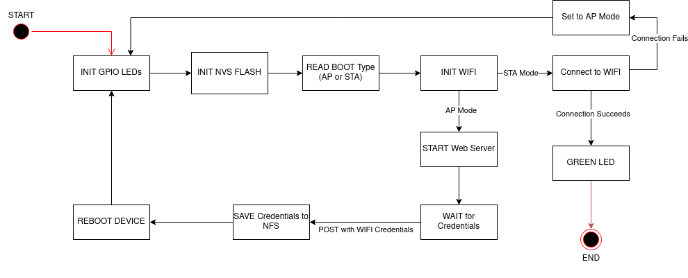

# ESP32 WIFI PROVISIONING

Simple implementation of WIFI Provisioning for ESP32 DEVKIT in the Espressif Framework.

AP Station Credentials

- SSID : ESP32AP
- PASSWORD : useruser
- Channel : 1

Web Server should be on **192.168.4.1**.

## Compiling and usage

The implementation is done in the Espressif Framework, for faster and easier compiling, I recommend the use of platformIO extension for Visual Studio Code(the development was done with aforementioned extension). If you decide not to, make sure to enlarge the size of HTTP header, this was done in sdkconfig.esp32dev.

## How it works

At first it initializes the 3 GPIO pins : **12(RED)**, **14(YELLOW)** and **27(GREEN)** which are used as control LEDs. Red is used when the system is booting up, yellow is used to indicated AP mode and green is used to show a successful connection in STA mode.

Afterwards it initializes the NVS Flash and reads the mode from it(either AP mode or STA mode), then it initializes the WIFI depending on the mode. AP mode lets the user connect to its WIFI and web server(**192.168.4.1**), where the WIFI credentials can be inputted, following this the system saves this credentials in the NVS and reboots. In STA mode it reads its NVS Flash and tries to connect to the WIFI, if it doesn't succeed, it reboots back in AP mode, otherwise it turns on the green LED.

## State Machine

